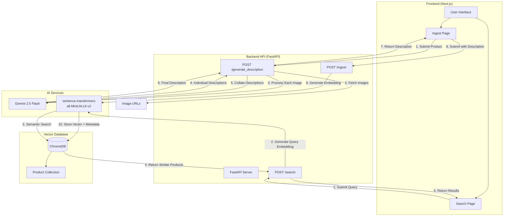
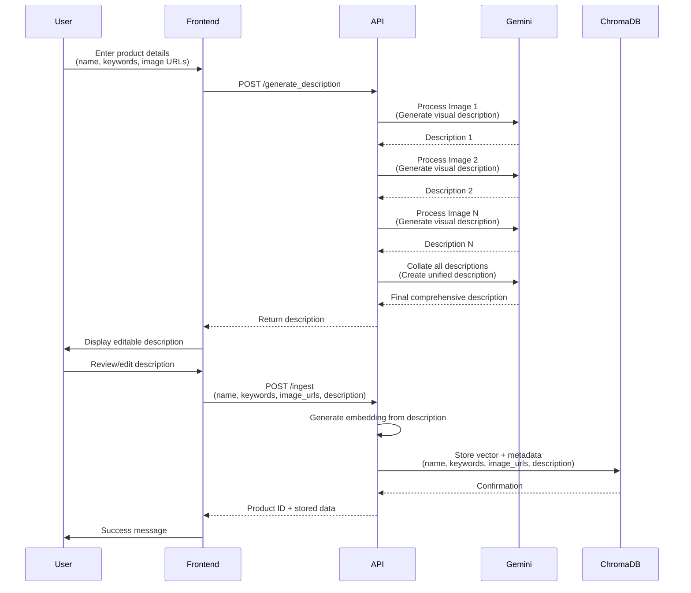
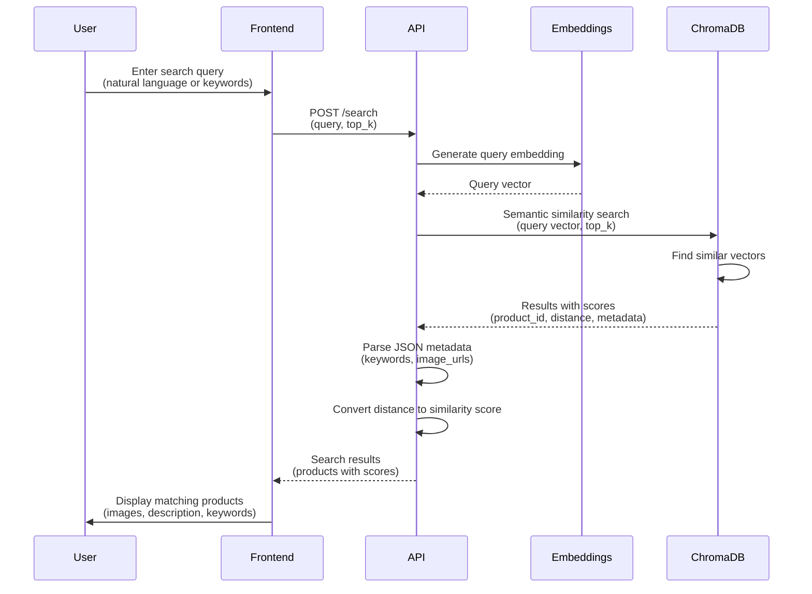
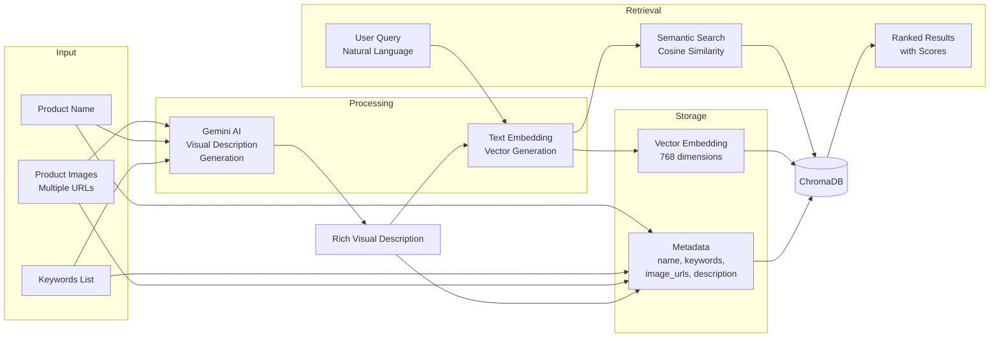
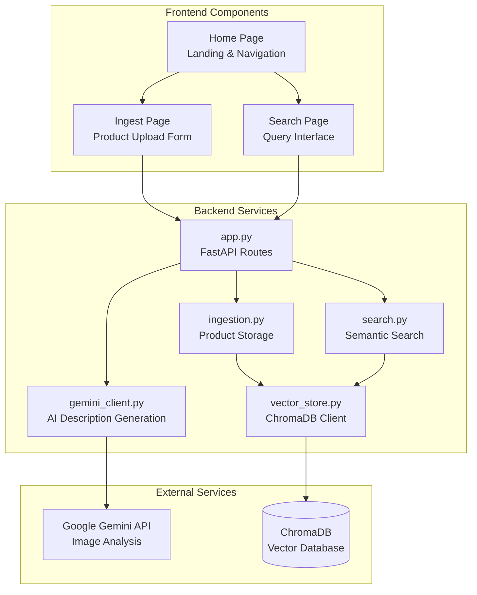

## Semantic Product Retrieval (Images + Gemini + Chroma)

This prototype ingests multiple product images, lets Gemini draft a unified description, and stores a semantic embedding in ChromaDB with rich metadata (name, image URLs, keywords). Queries can be keyword or natural language; results return product details and image references.

### System Architecture

### Ingestion Flow

### Search Flow

### Data Flow

### Component Details

### Quickstart
- Create a virtual environment and install deps:
  - `python -m venv .venv && source .venv/bin/activate`
  - `pip install -r requirements.txt`
- Set environment variables:
  
  **GEMINI_API_KEY** (Required):
  - Linux/Mac: `export GEMINI_API_KEY="your-api-key-here"`
  - Windows (PowerShell): `$env:GEMINI_API_KEY="your-api-key-here"`
  - Windows (CMD): `set GEMINI_API_KEY=your-api-key-here`
  - Or set it inline when running: `GEMINI_API_KEY="your-key" python src/app.py`
  
  **CHROMA_DIR** (Optional):
  - Path to persist the vector store (defaults to `.chroma`)
  - Example: `export CHROMA_DIR="./data/chroma"`
- Run the API:
  - `python src/app.py` (or `uvicorn src.app:app --reload`)

### Frontend (Next.js)
- Install Node dependencies:
  - `cd frontend && npm install`
- Run the UI (defaults to http://localhost:3000):
  - `npm run dev`
- Configure API base (optional):
  - Set `NEXT_PUBLIC_API_BASE` (defaults to `http://localhost:8000`)
- Use the UI to ingest products (name, keywords, image URLs) and search semantically.

### API
- `POST /generate_description`
  - Body: `{ name: string, keywords: [string], image_urls: [string] }`
  - Processes each image individually with Gemini, then collates descriptions into one comprehensive visual description.
  - Returns: `{ description: string }`
- `POST /ingest`
  - Body: `{ name: string, keywords: [string], image_urls: [string], description: string }`
  - Description is required (must be generated via `/generate_description` first).
  - Generates embedding from description and stores vector + metadata in ChromaDB.
  - Returns: `{ product_id: string, description: string, metadata: object }`
- `POST /search`
  - Body: `{ query: string, top_k?: int }` (default top_k: 5)
  - Performs semantic similarity search using query embedding.
  - Returns: `{ results: [{ product_id, score, metadata }] }`

### Notes
- Embeddings use `sentence-transformers/all-MiniLM-L6-v2` via Chroma’s HuggingFace integration (change in `vector_store.py` if desired).
- Gemini calls use image URLs; ensure the URLs are publicly reachable. Replace the `generate_description` logic if you already have descriptions.
- This is a minimal reference implementation; production deployments should add auth, validation hardening, retries, and monitoring.

